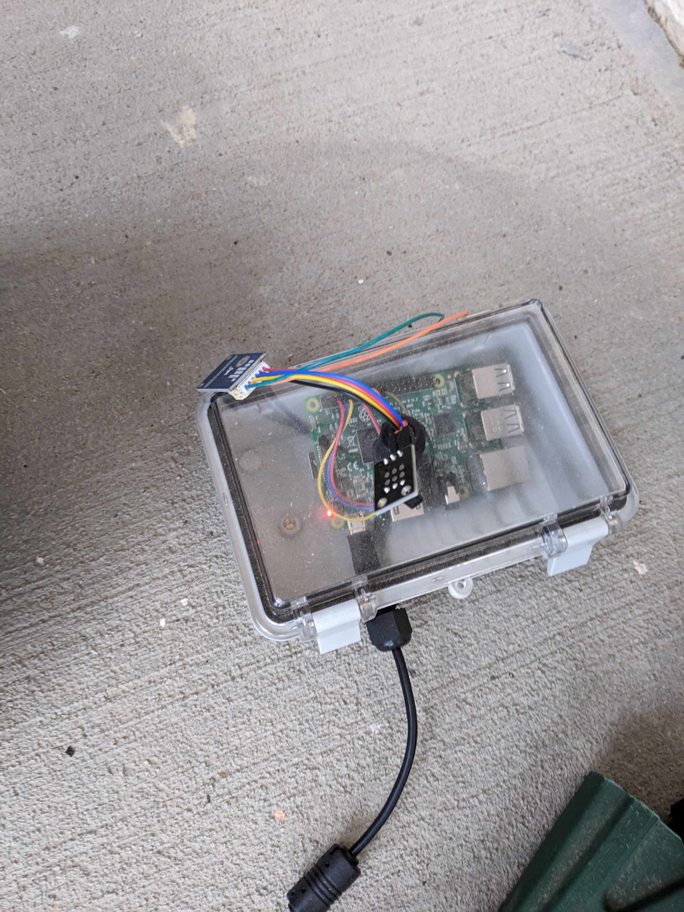
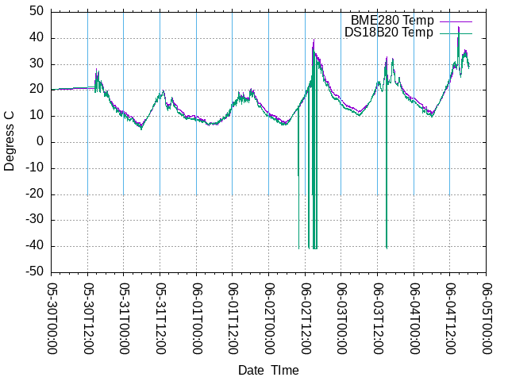
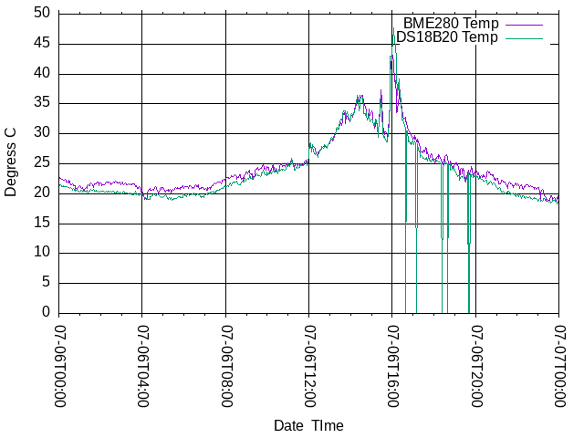

# Slightly remote atmospheric data collection

BME280 and DS18B20 sensors on a Raspberry Pi 3b+

Don't use a [DHT11](https://github.com/bediger4000/dht11_service) - they suck all around.
Spend a few extra dollars on a BME280.
More accurate, has a wider range, and better, easier to use driver.

## Design

Have a Raspberry Pi in a somewhat water-resistant box outside,
reading atmospheric data
(temperature, relative humidity, barometric pressue)
sensors.
The Raspberry Pi can connect to the house's WiFi network,
so there's need for any cabling.

A server process runs on some suitable Linux machine.
It is addressable by the Raspberry Pi collecting data.
The Raspberry Pi periodically takes sensor readings,
then sends them back to the server process via the local network.

The server process records the data for later use in visualizations,
weather predictions, etc.
No data resides on the Raspberry Pi, since it can get unplugged,
crash or suffer catastrophy like getting wet or iced up.



## Sensor hardware experience

DHT-11 temperature/relative humidity sensors are garbage.
Don't use them, you can't trust them.
They have a silly, CPU-intensive, error-prone electronic interface.

The BME280 I bought sometimes "goes away".
I have to power cycle to get it to send data to the RasPi.

The DS18B20 temperature sensor that I got in a "Kookye" assortment of
"IoT" sensors from Amazon periodically has some problems:



DS18B20 communicates via the 1-Wire protocol.
There's a Raspbian kernel driver for it.
But occasionally the device file disappears.
My Python daemon says temperature is -41C when that happens.

If reading the device file doesn't give the expected text output,
my Python daemon says temperature is -40C.

All the DS18B20 temperature "dropouts" in the above image have a -40 reading
followed by a series of 1 or more -41 readings.
The Python code found and read the device file, 
but didn't get the expected output.
That was followed by the device file disappearing for a while.
I didn't reboot, power-cycle, or unplug and reseat the DS18B20 in the time interval
shown above.
I have no idea what's going on, that's contrary to my experience with other
electronic devices.



New mode of failure: read the temperature a 0C.
I really don't know what's going on here.
The [code](station.py) can only return a temperature of 0C if that's the reading.
Missing device files, missing device file directories, etc,
all cause the code to emit something like -40, -41, -42C.

I have no idea if this is common to DS18B20 probes,
or if this particular "Kookye" box was just full of crap implemenations,
like the garbage DHT-11 implemenation in the same box.

## Raspberry Pi

I2C has to be turned on for the BME280.
1-wire has to be turned on for the  DS18B20.
Use `raspi-config` to do this.

`/boot/config.txt` has this in it after configuring:
```
dtparam=i2c_arm=on
dtoverlay=w1-gpio
```

I think SPI has to be turned off.

Raspberry Pi robably needs a reboot to work after these changes.

### Sensor connectivity

You can check that the DS18B20 is wired correctly by:

```sh
$ ls -l /sys/bus/w1/devices/
total 0
lrwxrwxrwx 1 root root 0 Mar  1 10:30 28-3c01a8162918 -> ../../../devices/w1_bus_master1/28-3c01a8162918
lrwxrwxrwx 1 root root 0 Mar  1 19:59 w1_bus_master1 -> ../../../devices/w1_bus_master1
```

The "28-3c01a8162918" directory means the kernel detected a DS18B20.

The Linux kernel also loads modules `w1_therm` if it finds a DS18B20.

You can check that the BME280 is wired (mostly) correctly with:

```sh
$ pi@localhost:~ $ i2cdetect -y 1
     0  1  2  3  4  5  6  7  8  9  a  b  c  d  e  f
00:                         -- -- -- -- -- -- -- -- 
10: -- -- -- -- -- -- -- -- -- -- -- -- -- -- -- -- 
20: -- -- -- -- -- -- -- -- -- -- -- -- -- -- -- -- 
30: -- -- -- -- -- -- -- -- -- -- -- -- -- -- -- -- 
40: -- -- -- -- -- -- -- -- -- -- -- -- -- -- -- -- 
50: -- -- -- -- -- -- -- -- -- -- -- -- -- -- -- -- 
60: -- -- -- -- -- -- -- -- -- -- -- -- -- -- -- -- 
70: -- -- -- -- -- -- -- 77                         
```

The "77" is apparently the BME280 I've got.
Other brands will show as "76".
See [station.py](station.py) for a place that must have this number correct.

The "77" will show up even if the GND wire isn't connected,
but the BME280 won't produce any data,
so this isn't a great connectivity test.

## Client

[Code](station.py)

The client requires installing [RPi.bme28](https://pypi.org/project/RPi.bme280/).
The RPi.bme280 library seems reliable.

```sh
$ pip3 install RPi.bme280
```

Install the `smbus2` library:
```sh
$ pip3 install smbus2
```

## Data Saving Server

[Code](server.go)

I wrote the data saving server in Go (v1.17).
It should be portable to almost any Go-supported hardware/OS combo.
It does nothing special, opening a UDP port,
writing data it receives to stdout.

You do NOT want to expose this server to the internet.
Some fool will try to write things to it (DNS queries, etc etc)
and fill up your local storage.
That's why you have to specify an IP address for it to listen to on the command line.

### Build

The data saving server doesn't depend on any 3rd party Go packages.

```sh
$ go build server.go
```

### Run

```sh
$ nohup ./server 10.0.0.1 7689 > data.log 2> server.log &
```

If you don't have a systemd service keeping data saving server process running,
you will lose data - humans forget to restart background processes.

If you don't have a systemd server keeping the client process running on the Raspberry Pi,
you will loose data.
The RasPi will get power cycled or reboot and the client will no longer be running.

UDP really truly is unreliable.
